# Helpful Command Line Utilities

Below are some relatively new utilties which I have found very helpful for
exploring and troubleshooting Linux (or MacOS) systems.

- [rg](#rg)
- [fd](#fd)
- [bat](#bat)
- [gron](#gron)
- [lnav](#lnav)
- [ncdu](#ncdu)
- [htop](#htop)
- [goaccess](#goaccess)


## Installation

- Linux 

  - To quickly try out these utilities on a Linux machine, just follow these steps
    to download the binaries and create symlinks in your personal bin dir
    (`$HOME/bin`) which point to them. For ease of use, ensure that `$HOME/bin` is
    in your `PATH`

    ```bash
      # clone this repo in your $HOME dir
      $ cd && git clone git@github.com:mmcnl/linux_utils.git

      # create symlinks
      $ ./install.sh
    ```

   - NOTE: `htop` and `ncdu` have dependencies (eg `ncurses`) and so are better installed with `apt` 

- MacOS

  All of these utilities are availabe via `brew`

## rg

For recursively searching the filesystem for text within files,
[rg](https://github.com/BurntSushi/ripgrep) is a powerful, user-friendly, and
_much_ faster alternative to `grep`.

* Here's a [nice write
up](https://blog.burntsushi.net/ripgrep/) about how `rg` compares to other search tools.

## fd

For finding files by name, [fd](https://github.com/sharkdp/fd) is a simple, fast
and user-friendly alternative to the traditional UNIX `find` command.

* It is quite a bit faster than `find` and I find the syntax much easier to remember
* By default, `fd` respects `.gitignore` and doesn't show hidden files
* There is a nice demo on the [README](https://github.com/sharkdp/fd)
* For example, to find and get the details (using `ls -lh`) of all files in
  `/var` that are bigger than 50MB, modified within the last 2 days, and have
  `sql` in their full-path:
  
  ```
  $ sudo fd --size +50M --changed-within '2 days' --full-path sql /var/ --exec ls -lh

  -rw------- 1 root root 70M Apr 18 12:59 /var/lib/fail2ban/fail2ban.sqlite3
  -rw-rw---- 1 mysql mysql 48M Apr 18 12:55 /var/lib/mysql/ib_logfile0
  -rw-rw---- 1 mysql mysql 76M Apr 18 12:55 /var/lib/mysql/ibdata1
  -rw-rw---- 1 mysql mysql 76M Apr 16 23:21 /var/lib/mysql/imc@002dwp@002dlive/wp_relevanssi.ibd
  -rw-rw---- 1 mysql mysql 96M Apr 17 22:10 /var/lib/mysql/irc@002dwp@002dlive/wp_posts.MYD
  -rw------- 1 remote-backup remote-backup 177M Apr 18 09:31 /var/local/backups/mariadb/sarana-live-web1-mariadb-full-20200418-093101.sql
  -rw------- 1 remote-backup remote-backup 178M Apr 17 21:31 /var/local/backups/mariadb/sarana-live-web1-mariadb-full-20200417-213101.sql
  -rw------- 1 remote-backup remote-backup 177M Apr 17 09:31 /var/local/backups/mariadb/sarana-live-web1-mariadb-full-20200417-093101.sql
  -rw------- 1 remote-backup remote-backup 177M Apr 16 21:31 /var/local/backups/mariadb/sarana-live-web1-mariadb-full-20200416-213101.sql 
  ```

## lnav

[lnav](https://lnav.org/) is a nice ncurses-based log viewer with very powerful
search and filtering and real-time log observation. It's pretty impressive how
well it can view aggregated and interleaved logs from various files (including
automatic expansion of `.gz` files). See http://lnav.org/features and
https://lnav.readthedocs.io/en/latest/hotkeys.html for more info. Here are some
usage examples:

* For example, say you wanted to get a sense of what log files are active within
  the last day. First you could use `fd` to list those files:
```
$ fd --type f --changed-within '1 day' log  /var/log
/var/log/ansible.log
/var/log/fail2ban.log
/var/log/logwatch.log
/var/log/monit.log
/var/log/nginx/access.log
/var/log/nginx/error.log
/var/log/rkhunter.log
/var/log/syslog
/var/log/ufw.log
```
Then you could pipe that file list to `lnav` and see (and tail in realtime) all
those logs:
```
$ fd --type f --changed-within '1 day' log  /var/log | sudo xargs lnav -q
```
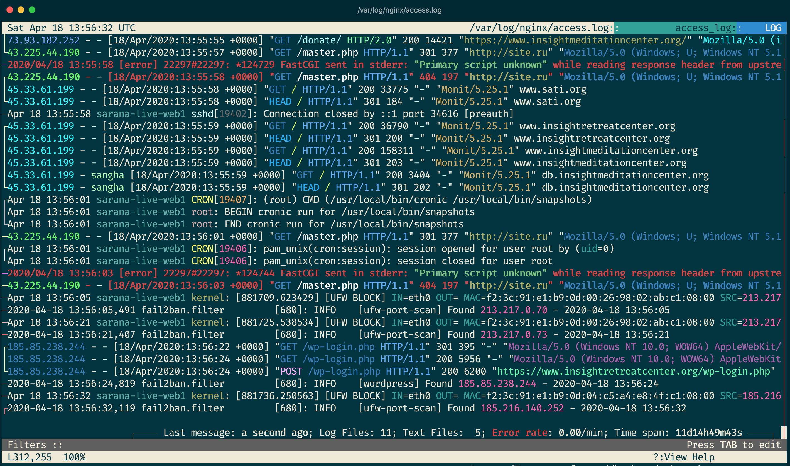

Then you might get interested in seeing logs related to `cron` jobs, so you
could add an `lnav` filter (press TAB key) to just show lines matching `cron`:
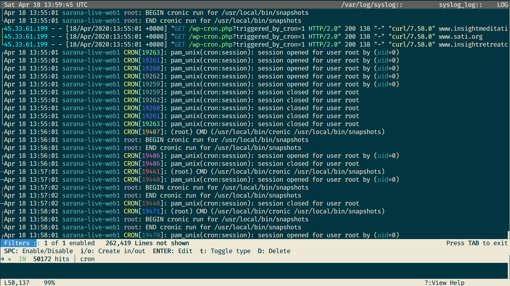

To add filters (using `cron` as an example):
1. Press `TAB` key.
1. Enter `i` + `cron` = to add a filter that displays all lines that contain `cron`.
1. Enter `o` + `cron` = to add a filter that displays all lines that do not contain `cron`.
1. Press `D` to remove a filter from the filter set.
1. Press `TAB` to exit filter editing mode.

Also see the `lf` section below for an example of using the `lnav` [histogram feature](https://lnav.readthedocs.io/en/latest/hotkeys.html#display)

## gron

[gron](https://github.com/tomnomnom/gron) is a neat utility that makes JSON easily searchable via `grep` (or `rg`). I find this easier to use than `jq`, especially when I don't already know the exact (possibly deeply nested) structure of a document. Here's an example of getting some metadata from `archive.org`:

```
❯ ia metadata goodytwoshoes00newyiala | gron | rg 'reviewer|stars' | head
json.reviews[0].reviewer = "TallpailofH20";
json.reviews[0].stars = "4";
json.reviews[1].reviewer = "ErniePye";
json.reviews[1].stars = "4";
json.reviews[2].reviewer = "kiju7";
json.reviews[2].stars = "5";
json.reviews[3].reviewer = "Cindy Joffrion";
json.reviews[3].stars = "3";
json.reviews[4].reviewer = "korean";
json.reviews[4].stars = "3";
```

## lf
[lf](https://godoc.org/github.com/gokcehan/lf) is a terminal file-manager (like
`ranger` but faster and lighter weight) with `vim` bindings and a nice preview
(set our custom setup at `/usr/local/bin/lf-preview`). It works well, for
example, to:

* quickly scan the contents of a directory, for example checking the nginx
config of the current websites: 
```
$ lf /etc/nginx/sites-enabled/
```
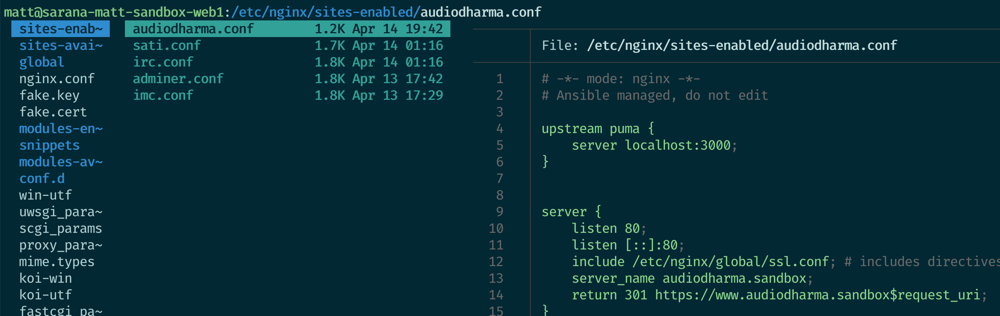

* view code files with syntax-highlighting: 
```
$ lf /var/www/imc/current/ 
```
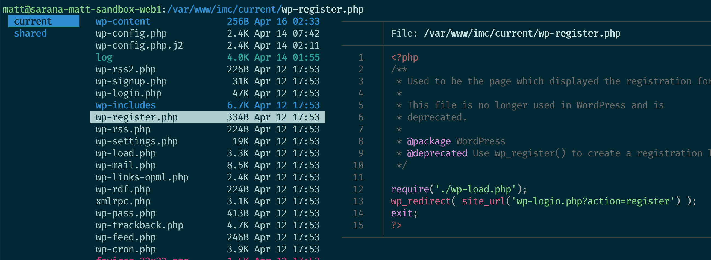

* preview various kinds of other content including pdfs and Word docs: 
```
$ lf /var/www/imc/shared/wp-content/uploads/2020/04
```
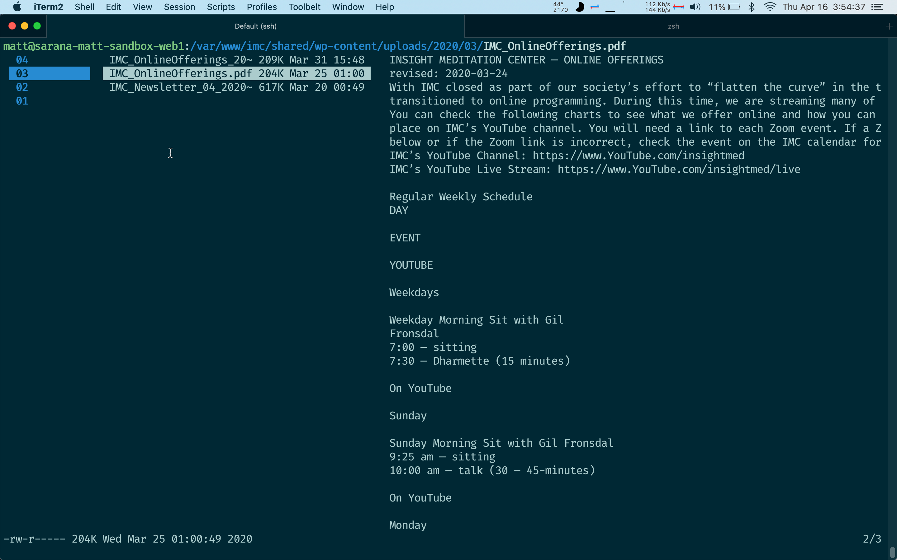

Here's an example of using `lf` and `lnav` to get a sense of recent nginx request volume.
* First, use `lf` to get an overview of recent logs and mark a few files (with
  space key) from the past few days (including `gz` compressed logs):

```
$ sudo lf /var/log/nginx
```

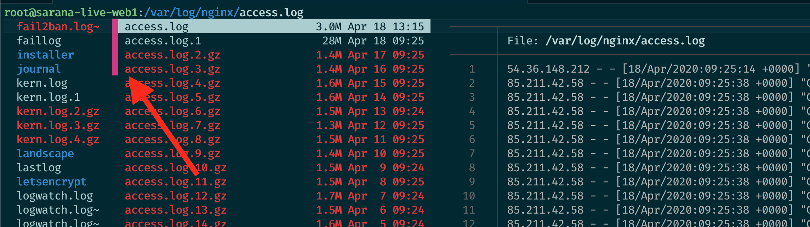

* Then, press the `L` key (see below for custom keybindings) to send those
  marked files to `lnav` and view them aggregated together:

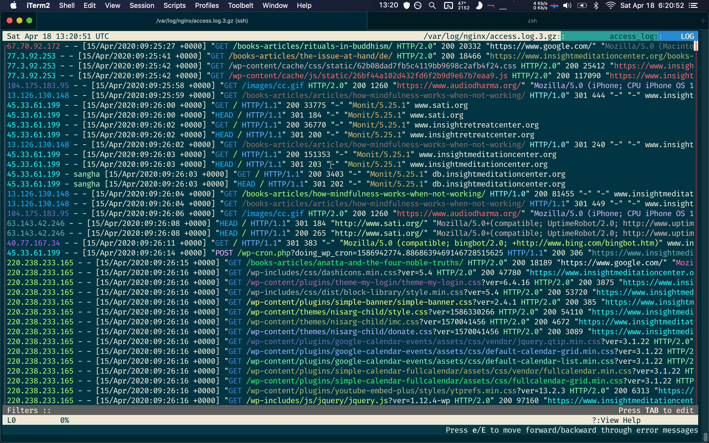

* Then, switch to `lnav`'s histogram (using the `I` key) and zoom out (using the
  `Z` key) (https://lnav.readthedocs.io/en/latest/hotkeys.html#display) to get
  an overview of the nginx request volume over the days covered by those logs:

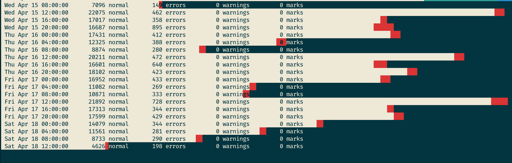

* our `lf` installation is configured with several custom commands, including
  one-key access to view the current or selected files using `L` for `lnav`, `T`
  for `tail`, `S` for `strings` (useful for binary files), `i` to send the file
  to view with `bat`, and `U` to check the directory usage with `ncdu`:

  ```bash
  $ rg '^map' /etc/lf/lfrc
  29:map <c-z> $ kill -STOP $PPID
  30:map <esc> :clear; unselect
  31:map L lnav
  33:map S $LESS='--RAW-CONTROL-CHARS' bash -c 'strings $fx | less'
  34:map T $LESS='--RAW-CONTROL-CHARS' less +G $fx
  35:map U ncdu
  36:map i $LESS='--RAW-CONTROL-CHARS' bat --paging=always $fx
  37:map q quit
  38:map td set dirfirst!
  39:map th set hidden!
  40:map tr set reverse!
  41:map x trash
  ```

## bat
[bat](https://github.com/sharkdp/bat) is a `cat` clone that does nice syntax
highlighting. (The preview function in our `lf` installation is set to use `bat`
to preview code files.)

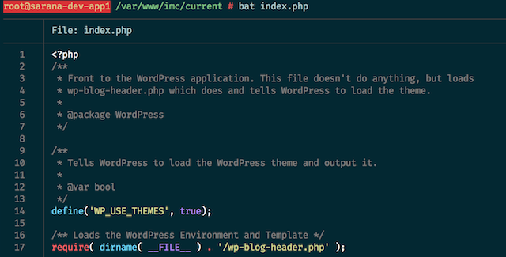


## ncdu
[ncdu](https://dev.yorhel.nl/ncdu/man) is a curses-based version of the
well-known `du`, and provides a fast way to see what directories are using your
disk space. For example, you can explore the IMC uploads directory:

```
$ ncdu /var/www/imc/current/wp-content
```
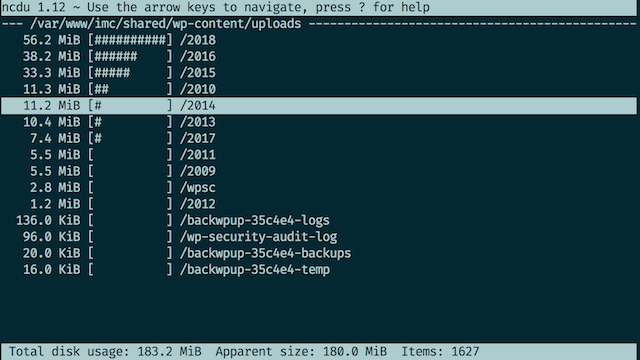

## htop
[htop](https://github.com/hishamhm/htop) is an improved version of `top`. Here's a decent [guide](https://www.maketecheasier.com/power-user-guide-htop/) to using it

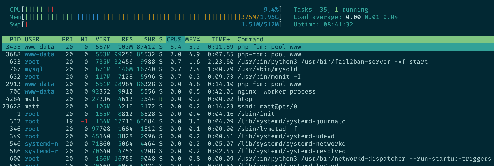

## goaccess
[goaccess](https://goaccess.io/) is a fast and powerful Apache/nginx log analyzer. 
Here's how to parse the last days' nginx logs on the new server:
```
matt@sarana-live-web1 ~ $ sudo goaccess /var/log/nginx/access.log
```
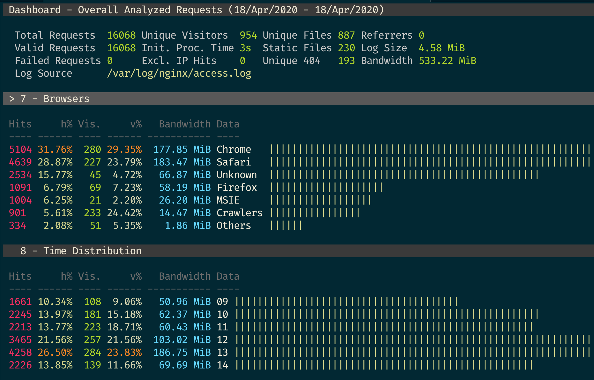

Here's an example of parsing apache logs on the old server:

```
mmcneil@sati:/var/log/apache2$ sudo zcat media.audiodharma.org-access.log.{2..5}.gz | sudo goaccess media.audiodharma.org-access.log media.audiodharma.org-access.log.1 -
```
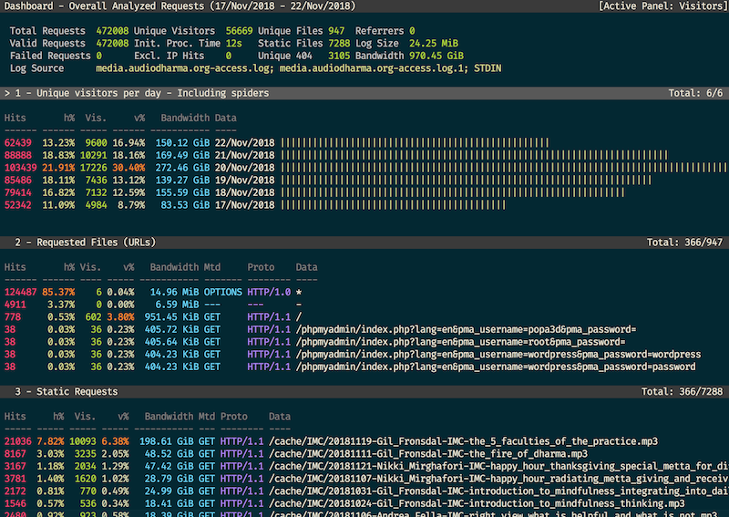
